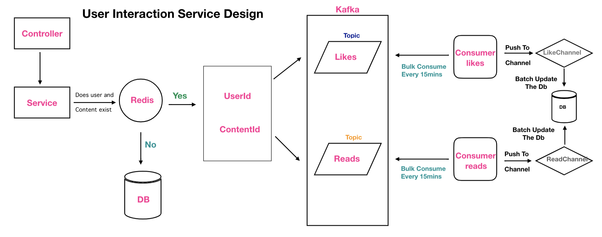

# Interaction Service

> Intercation Service to read and like a story built with Golang ang gin package

## Features

- Functionality to read and like a post

### Env Variables

Create a .env file in then config folder and add the following

```
APP_ENV=service name
DB_USERNAME=user name of db
DB_HOST_READER=reader db url
DB_HOST_WRITER=writer db url
DB_PORT=port on which db is running
DB_PASSWORD=password of the db
DB_NAME=name of the database
DB_MAX_IDLE_CONNECTION=maximum no of idle connections
DB_MAX_OPEN_CONNECTIONS=maximum no of open connections
SERVICE_NAME=name of the service
SERVER_PORT=port on ehich server will run
REDIS_ADDRESS=redis url
CACHE_ENABLED=boolean value to control redis cache
KAFKA_BROKERS=list all the kafka brokers
KAFKA_LIKE_TOPIC=create a topic to insert likes data into the topic
KAFKA_READ_TOPIC=create a topic to read story content
LIKE_CHANNEL_SIZE=like go-channel size
READ_CHANNEL_SIZE=read go-channel size
WAIT_TIME_FOR_CONSUMER=minimum time to wait before the consumer starts consuming from the channel
BATCH_SIZE_FOR_PRODUCER=maximum number of messages to publish in the kafka topic at once
BATCH_TIMEOUT=wait for the amount of time before producing message
MAX_NUMBER_OF_TOP_CONTENTS=number of top rated contents you want to fetch
INTERACTION_HEADER=header string to pass by any service to access the internal api endpoint
```

### Install Dependencies

```
go mod download
go build
```

### Run

```
# Run backend (:4000)
go run .
```

## HLD User Interaction Service
